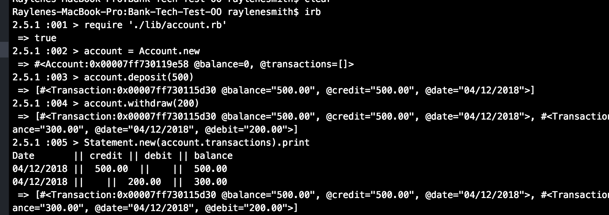

# Bank Tech Test
This is a practice tech test. We were required to satisfy the specifications and acceptance criteria set out below.

My approach for this project was to use TDD, DRY and SRP to create a clean, functioning program that was easy to read and change. My program relies on three separate classes to create the functionality required by the specifications: account, transaction, and statement. These classes work together to allow the user to create an account, make deposits and withdrawals, and view their statement.

I have also feature tested and unit tested the program. Instructions for how to run the tests are included below.

## How To Set Up & Use Program
### Set Up:
1. Fork this repo and download the files
2. Run 'bundle install'
3. To run tests, use the command 'rspec'
3. Start irb in your console, and run the following commands:
  * require './lib/account.rb'
  * account = Account.new

### Using the Program:
To withdraw and deposit in your account, you can run the following commands:
* account.deposit(amount_of_your_choice)
* account.withdraw(amount_of_your_choice)

To print your statement, run the following commands:
* Statement.new(account.transactions).print

### Example:

## Specification
You should be able to interact with your code via a REPL like IRB or the JavaScript console. (You don't need to implement a command line interface that takes input from STDIN.)
Deposits, withdrawal.
Account statement (date, amount, balance) printing.
Data can be kept in memory (it doesn't need to be stored to a database or anything).

## Acceptance criteria
Given a client makes a deposit of 1000 on 10-01-2012
And a deposit of 2000 on 13-01-2012
And a withdrawal of 500 on 14-01-2012
When she prints her bank statement
Then she would see

date || credit || debit || balance
14/01/2012 || || 500.00 || 2500.00
13/01/2012 || 2000.00 || || 3000.00
10/01/2012 || 1000.00 || || 1000.00
